# dockviewers

[](https://crates.io/crates/dockviewers)
[](https://docs.rs/dockviewers)

<br>
[](https://github.com/EV-invest/dockviewers/actions?query=branch%3Amain) <!--NB: Won't find it if repo is private-->
[](https://github.com/EV-invest/dockviewers/actions?query=branch%3Amain) <!--NB: Won't find it if repo is private-->

🌐 **[Live demo](https://ev-invest.github.io/dockviewers/)** — no setup, runs in the browser.

A tiling/docking layout for [Dioxus](https://dioxuslabs.com/) and [Leptos](https://leptos.dev/) — the IDE/trading-terminal kind: panes split, resize, tab together, float, and maximize, with the arrangement cached per screen size and restored on reload.



A random fuzz run (seed 172), not a demo. For the real thing, [play with it](https://ev-invest.github.io/dockviewers/).
// generate it yourself: `cargo r --example fuzz_film -p dockviewers_core -- --seed 172`.

## Usage
Hand `PackedArea` a `Signal` of `DockPanel`s (id + title + the content to render); the library owns layout, you own content.

```rust
use dioxus::prelude::*;
use dockviewers_dioxus::{Config, DockPanel, Group, MinSize, PackedApi, PackedArea, PanelId, Step};

fn app() -> Element {
    let panels = use_signal(Vec::<DockPanel>::new);
    // The per-tile `+` button asks the host to open a tab; it must find this in context.
    use_context_provider(|| Callback::new(|_gid| {}));

    let on_band = Callback::new(move |mut api: PackedApi| {
        // The cache already had this band's layout; re-attach content by walking `api.tab_ids()`.
        if api.restored() { return }
        let mut panels = panels;
        panels.write().clear();
        for (id, title) in [("chart", "Chart"), ("orders", "Orders")] {
            let id = PanelId(id.into());
            panels.write().push(DockPanel { id: id.clone(), title: title.into(), content: rsx! { "…" } });
            let gid = api.mint_group_id();
            api.place(Group::new(gid, id), 22, 16, MinSize::Steps { w: Step(4), h: Step(3) });
        }
    });

    let config = Config { storage_key: Some("my-app-layout".into()), ..Default::default() };
    rsx! {
        // Needs a sized parent; height:100% collapses to 0 otherwise.
        div { style: "position:fixed; inset:0;",
            PackedArea { panels, on_band: Some(on_band), config: Some(config) }
        }
    }
}
```

Runnable demo: `dx serve --example insilico --package dockviewers_dioxus --platform web` — or open the [hosted demo](https://ev-invest.github.io/dockviewers/), no local setup needed. The Leptos binding is the same component with `Arc<dyn Fn(PackedApi) + Send + Sync>` in place of `Callback` — see `examples/insilico_leptos`.

**Props:** `panels` (order = stable overlay render order — don't reorder it, that remounts panels), `on_band` (see below), `config`.

**Bands and the seed cache.** A container width classifies into one of three `Band`s — `sm`/`md`/`xl` — each keeping its own arrangement, because a phone doesn't want a desktop's tiling. Set `Config::storage_key` and the framework caches the layout in `localStorage` under `<key>-<band>` on `Alt+S`, restoring it before your code runs. `on_band` fires once per band entry — at mount, and again on every crossing — *after* that resolution:

- `api.restored()` ⇒ the cache had a layout and the grid is already populated; walk `api.tab_ids()` to rebuild your panel list from the ids it holds.
- otherwise the grid is empty and it's yours to fill: `place` your tiles, or `load` a default you fetched yourself.

A cached payload that is corrupt, from a future schema, or empty counts as a miss and says so on the console — never a silent reset. Persistence is wasm-only (a no-op natively, so every band reports a miss).

**Publishing a default.** The framework never talks to a server. `Alt+Shift+S` hands `Config::on_save` a `Saved::Published { band, json }` and does nothing else; persist it wherever you like (behind your own authorization) to become the default fresh clients `load` in `on_band`. `Alt+S` fires the same hook with `Saved::Cached { band }`, for feedback — the write already happened.

**Scripting** — `PackedApi` arrives through `on_band`; stash it in a signal to drive the dock from elsewhere. Every method is a read/write of the one state cell:

```rust
let gid = api.mint_group_id();
api.place(Group::new(gid, id), w, h, min); // auto-packs left-to-right, top-to-bottom
api.add_tab(gid, panel_id);
api.close_active(gid);
api.resize(idx, new_w, new_h);
api.reset();                               // wipe the layout back to empty
let json = api.save(); api.load(&json)?;   // `load` errors on corrupt/future JSON
api.cols(); api.band(); api.tab_ids();
```

**Keybinds** (`Config::keybinds`, all rebindable; `?` lists the live set): `u`/`U` undo/redo, `Backspace` closes the focused pane, `f` maximizes it, `d` inspects the tile under the cursor, `Alt+S` caches, `Alt+Shift+S` publishes. None fire while an editable field has focus. `Config::actions` takes your own `(Keybind, Rc<dyn Fn(&mut PackedState)>)` pairs.

**Grid** — `Config::steps` (default 64) is the desktop column count, scaled down per band so the *physical* step stays ~constant and tiles reflow instead of shrinking; `rows` (default 36) is fixed.

**Theming** — only structural CSS ships; set `--dv-*` custom properties on any ancestor for colors/sizes (`--dv-accent`, `--dv-fg`, `--dv-group-bg`, `--dv-tab-bg`, `--dv-tab-active-bg`, `--dv-tab-active-fg`, `--dv-tab-border`, `--dv-tabstrip-bg`, `--dv-resize-bg`, `--dv-shadow-bg`, `--dv-content-pad`).


<br>

<sup>
	This repository follows <a href="https://github.com/valeratrades/.github/tree/master/best_practices">my best practices</a> and <a href="https://github.com/tigerbeetle/tigerbeetle/blob/main/docs/TIGER_STYLE.md">Tiger Style</a> (except "proper capitalization for acronyms": (VsrState, not VSRState) and formatting). For project's architecture, see <a href="./docs/ARCHITECTURE.md">ARCHITECTURE.md</a>.
</sup>

#### License

<sup>
	Licensed under <a href="LICENSE">Blue Oak 1.0.0</a>
</sup>

<br>

<sub>
	Unless you explicitly state otherwise, any contribution intentionally submitted
for inclusion in this crate by you, as defined in the Apache-2.0 license, shall
be licensed as above, without any additional terms or conditions.
</sub>

