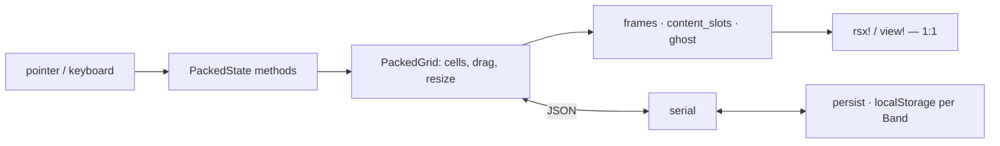

# Architecture

A packed-grid tiling layout: tiles have a fixed starting size, snap to a step grid,
never overlap, and leave whitespace below (InsilicoTerminal's look). One engine
(`dockviewers_core`) drives two bindings (`dockviewers_dioxus`, `dockviewers_leptos`).

## The one idea

Everything a renderer would keep in reactive cells lives on **one plain struct**,
`PackedState`, and every event is a `&mut self` method taking already-extracted
primitives. The binding does the DOM read and passes numbers and strings in; it gets
back plain view-model data (`frames`, `content_slots`, `ghost`) with inline styles
already computed, which a template renders 1:1.

So the whole gesture machine — drag, resize, undo, refit, keybinds, the seed cache —
is ordinary Rust, testable without a DOM, and shared verbatim by both bindings. A
binding is a few hundred lines of glue holding exactly one reactive cell.

Content is the other half: one absolutely-positioned wrapper **per panel** in a stable
id-keyed list, positioned over its tile's measured box. That overlay is why a panel
keeps its component instance (and inner JS state, e.g. a live map) while being dragged
across the grid.

## Codemap

`dockviewers_core`:
- `model/packed` — the grid itself: `Cell` rects in step units, the skyline `pack`,
  `settle` (gravity toward the top, with the pinned tile claiming its row first),
  `resolve_target`/`drop`, `refit` for a column-count change. The no-overlap invariant
  lives here (`assert_packed`) and is guaranteed while `GridState::Settled`.
- `model/group` — a tile's tab-group: many panels, one active.
- `model/serial` — versioned JSON. `PackedGrid` *is* the serialized value; the schema
  tag is the seam for migrations, and `load` errors on a younger payload rather than
  silently wiping a workspace.
- `state` — the reducer over `PackedState`: gestures, undo history, `on_key`, the
  measure/refit path, the view-model getters, and the **band latch** (below).
- `config` — `Config` (steps/rows/keybinds/storage key/save hook), `Keybinds`,
  `Breakpoint` (5 widths, sets the column count) and `Band` (3 widths, the persistence
  key), `Saved`.
- `persist` — `localStorage` read/write, wasm-only (a native no-op), crate-internal.
- `css` — the one structural stylesheet; colors and sizes are `--dv-*` custom properties.

Bindings (`dockviewers_dioxus`, `dockviewers_leptos`) hold `PackedState` in one reactive
cell, forward DOM events into it, render the view-model, and expose `PackedApi` — a cheap
handle over that cell — to the host through `on_band`.

## The seed cache

A layout is stored per `Band` (`sm`/`md`/`xl`), not per `Breakpoint`: neighbouring
breakpoints differ only in column count, which `refit` handles, while a phone-sized
arrangement is genuinely worth keeping apart from a desktop one.

`PackedState::take_band` is the latch. Both bindings call it after *every* measure; it
returns `Some(restored)` only when a real step size has landed and the band differs from
what is on screen — i.e. once per band entry. On that edge it resets the grid, and, if
`Config::storage_key` is set, tries `localStorage` under `<key>-<band>`. The binding then
invokes the host's `on_band`, which sees `api.restored()` and either re-attaches content
to the restored tiles or lays out a fresh spread.

The framework caches on `Alt+S` and **never talks to a server**. `Alt+Shift+S` hands the
JSON to `Config::on_save` and does nothing else; a host that wants a site-wide default
persists it itself, behind its own authorization, and `load`s it in `on_band` when the
cache missed. Precedence is therefore: client cache → host default → host built-in seed.

## Invariants

- `PackedState` is the sole source of truth; every interaction is a `&mut self` mutation.
- Cells never overlap while the grid reports `Settled`, and nothing is ever left hanging:
  `settle` pulls every tile up onto the skyline of the tiles above it.
- The content overlay's render order is **independent of layout** — never reorder it, or
  instances remount and stateful panels (maps, scroll, focus) reset.
- `focused`/`maximized` are overlay state beside the grid, never cells; they are filtered
  through `live()` so a stale id is inert. `drag`/`resize` hold cell *indices*, so anything
  that clears cells (`reset`, and hence the band latch) must clear them too.
- Pixel layout is the browser's job; the model is unit-free steps. Measured boxes are the
  one re-entry of pixels.
- A cached layout that is corrupt, from a future schema, or empty is a **miss** that says
  so on the console — never a silent wipe.

## References

- `docs/refs/dockview-core` was the port source for the original split-tree design; the
  packed grid replaced it, so it is history rather than a spec.
- insilicoterminal (the visual target) is a *custom* Vue split-tree, not a library — only
  the look is taken from it.
